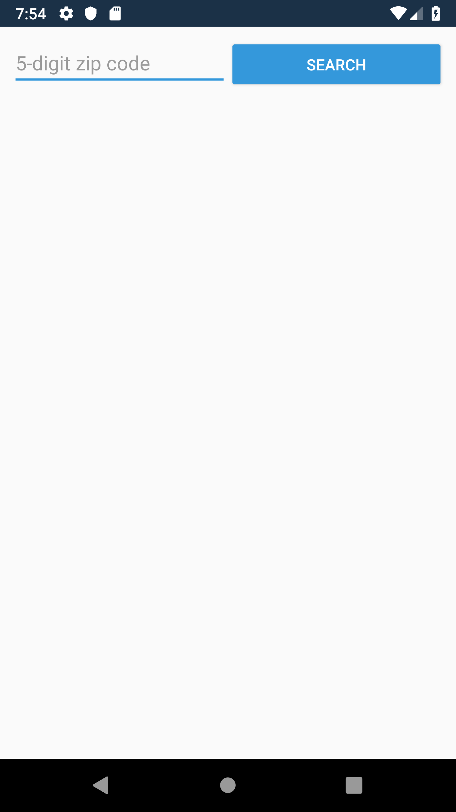
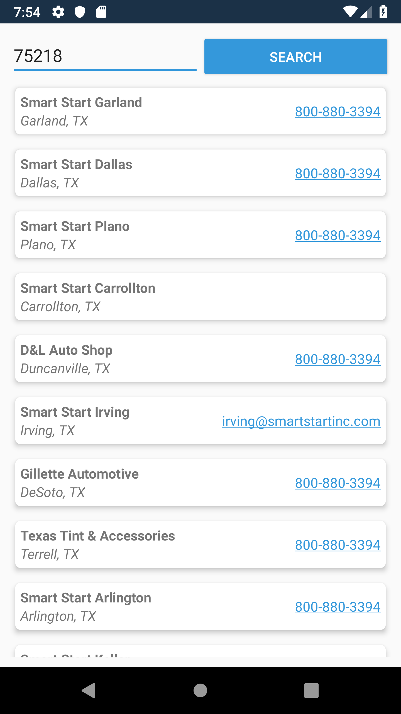

# Smart Start Mobile Team Interview Coding Challenge

## Introduction
This repository is a starting template for performing the Smart Start Mobile Team interview coding challenge.  The challenge asks you to start from the provided Visual Studio solution, and build out functionality in a simple single-view app.  This app will call an existing Smart Start REST API endpoint to obtain a list of our physical Store Locations, given some input parameters.  It will then display the results from this API call in a tabular format.  You are free to use any online resource to help you put together your best development work.  However, please refrain from direct assistance from individuals.

## System Requirements
Ideally, you will build out solutions for both iOS and Android, which requires that you develop on a Mac.  However, if you do not have a Mac, you can stick with just an Android implementation, and develop in Windows.
### Mac (preferred)
- Visual Studio 8.3
- Xcode 11
### Windows
- Visual Studio 2019

## Coding Challenge
Swagger UI documentation and test harness for this endpoint can be accessed [here](https://sasha-borodin-ssi.github.io/xamarin-interview/api/)

Your solution should intake a 5-digit Zip Code from the user.  It should then call the REST API with the given input (and other default parameters).  The JSON response should be deserialized and presented in a tabular format.  The data points you will need to display are:
1. Name
1. City and State
1. Phone Number (if any)
1. Email Address (if any)

The solution includes 3 projects, each of which require code to be added:
1. XamarinInterview.Shared
    - This project contains a “service” class that should perform the REST API call, and parse its response.
1. XamarinInterview.iOS
    - This project contains a view controller class and storyboard file to support the single search/results view.
1. XamarinInterview.Droid
    - This project contains an action class and layout files to support the single search/results view.

## Instructions
1. Start by cloning this repository.
1. Commit incremental changes to your local repository.
1. When finished, submit a pull request for your changes.

## Sample Solution Screenshots
[Droid demo movie](https://github.com/sasha-borodin-ssi/xamarin-interview/raw/master/docs/screenshots/droid.mov)

